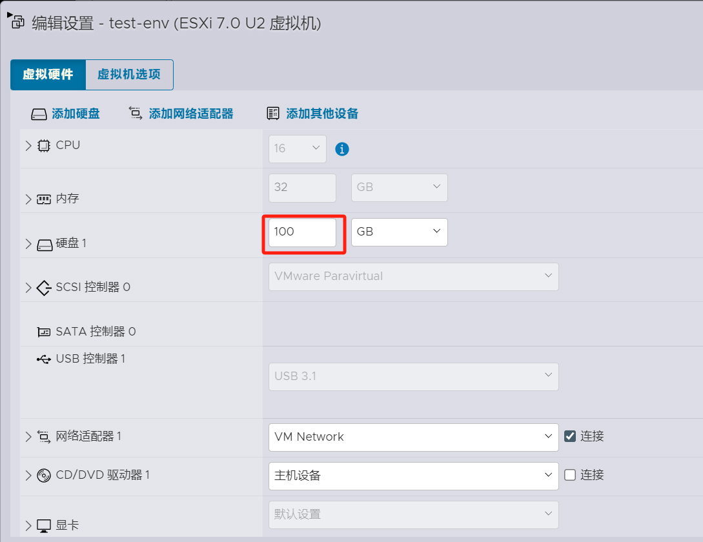

# CentOS 7 虚拟机不停机扩容磁盘 

## 前言  

最近在ESXI上做 CentOS 7 虚拟机的磁盘扩容，发现 CentOS 7 虚拟机默认安装的磁盘空间大小为 40GB，网上爬来的文章大多需要重启虚拟机，这对于生产环境的虚拟机来说是不合适的。因此，需要找到一种不停机的扩容方式。  

其中大部分文章里，需要停机的原因有两处：

1. 编辑现有磁盘需要停止VM，这个在ESXI上是不必要的。ESXI上可以直接在VM的设置中增加磁盘，或者修改现有磁盘大小。  
2. 扩容磁盘完成分区创建后，需要重启虚拟机以便虚拟机识别到新增加的分区。这个在centos上，也仅限针对当前磁盘进行扩容，但是可以通过`partprobe`命令让Linux内核识别到新增分区。而如果是通过新增磁盘的方式，则不需要该命令Linux内核便可以识别到。 

因此，本文重点介绍通过扩容磁盘的方式实现不停机的磁盘扩容方案。  

## 扩容方案1：新增磁盘

这种方式是最简单的，不需要停机，直接在VM设置中增加磁盘即可。然后VM里通过`fdisk`创建新的分区，`pvcreate`创建新的物理卷，`vgextend`将新的物理卷添加到VG中，然后`lvresize`调整LVM的大小，最后`xfs_growfs`调整文件系统大小。

这种方式简单粗暴，网上文章里提及的需要重启的点，都可以忽略。

## 扩容方案2：现有磁盘扩容

很多时候，我们并不想新增一块磁盘，哪怕是虚拟的（洁癖作祟吗？）。这时，我们可以选择现有磁盘进行扩容。

这种方式也可以做到不停机扩容。具体步骤如下：  

### 1. 宿主机操作 - 扩容现有磁盘

1. 在ESXI上，找到要扩容的虚拟机，点击`编辑`，找到要扩容的磁盘，修改磁盘大小后`保存`。  


### 2. 虚拟机操作 - 创建磁盘分区

1. 登录到虚拟机，使用`fdisk -l`命令查看现有磁盘信息。因为上一步修改的是默认的唯一磁盘，而非新增磁盘，这时centos并不能识别到磁盘大小的变化。  

```bash
[root@test-env ~]# fdisk -l

磁盘 /dev/sda：42.9 GB, 42949672960 字节，83886080 个扇区
Units = 扇区 of 1 * 512 = 512 bytes
扇区大小(逻辑/物理)：512 字节 / 512 字节
I/O 大小(最小/最佳)：512 字节 / 512 字节
磁盘标签类型：dos
磁盘标识符：0x000ede20

   设备 Boot      Start         End      Blocks   Id  System
/dev/sda1   *        2048     2099199     1048576   83  Linux
/dev/sda2         2099200    83886079    40893440   8e  Linux LVM

磁盘 /dev/mapper/centos-root：37.6 GB, 37576769536 字节，73392128 个扇区
Units = 扇区 of 1 * 512 = 512 bytes
扇区大小(逻辑/物理)：512 字节 / 512 字节
I/O 大小(最小/最佳)：512 字节 / 512 字节


磁盘 /dev/mapper/centos-swap：4294 MB, 4294967296 字节，8388608 个扇区
Units = 扇区 of 1 * 512 = 512 bytes
扇区大小(逻辑/物理)：512 字节 / 512 字节
I/O 大小(最小/最佳)：512 字节 / 512 字节

```

要解决这个问题，只需要手动`rescan`让centos识别到磁盘大小的变化就可以了。

```shell
# 先列出所有的scsi设备
[root@test-env ~]# ls /sys/class/scsi_device/
0:0:0:0  3:0:0:0
# 一般第一个是默认的硬盘设备，强制重新扫描该设备
[root@test-env ~]# echo 1 > /sys/class/scsi_device/0\:0\:0\:0/device/rescan
# 再次查看磁盘信息
[root@test-env ~]# fdisk -l

磁盘 /dev/sda：107.4 GB, 107374182400 字节，209715200 个扇区
Units = 扇区 of 1 * 512 = 512 bytes
扇区大小(逻辑/物理)：512 字节 / 512 字节
I/O 大小(最小/最佳)：512 字节 / 512 字节
磁盘标签类型：dos
磁盘标识符：0x000ede20

   设备 Boot      Start         End      Blocks   Id  System
/dev/sda1   *        2048     2099199     1048576   83  Linux
/dev/sda2         2099200    83886079    40893440   8e  Linux LVM

磁盘 /dev/mapper/centos-root：37.6 GB, 37576769536 字节，73392128 个扇区
Units = 扇区 of 1 * 512 = 512 bytes
扇区大小(逻辑/物理)：512 字节 / 512 字节
I/O 大小(最小/最佳)：512 字节 / 512 字节


磁盘 /dev/mapper/centos-swap：4294 MB, 4294967296 字节，8388608 个扇区
Units = 扇区 of 1 * 512 = 512 bytes
扇区大小(逻辑/物理)：512 字节 / 512 字节
I/O 大小(最小/最佳)：512 字节 / 512 字节

```

2. 创建磁盘分区，使用`fdisk`命令，在现有磁盘上增加一个分区。

通过`n`，`p`，`t`，`w`命令，分别创建主分区，扩展分区，设置分区类型，其中分区类型为8e，最后保存并退出。

```bash 
[root@test-env ~]# fdisk /dev/sda
欢迎使用 fdisk (util-linux 2.23.2)。

更改将停留在内存中，直到您决定将更改写入磁盘。
使用写入命令前请三思。


命令(输入 m 获取帮助)：n
Partition type:
   p   primary (2 primary, 0 extended, 2 free)
   e   extended
Select (default p): 
Using default response p
分区号 (3,4，默认 3)：
起始 扇区 (83886080-209715199，默认为 83886080)：
将使用默认值 83886080
Last 扇区, +扇区 or +size{K,M,G} (83886080-209715199，默认为 209715199)：
将使用默认值 209715199
分区 3 已设置为 Linux 类型，大小设为 60 GiB

命令(输入 m 获取帮助)：t
分区号 (1-3，默认 3)：
Hex 代码(输入 L 列出所有代码)：8e
已将分区“Linux”的类型更改为“Linux LVM”

命令(输入 m 获取帮助)：w
The partition table has been altered!

Calling ioctl() to re-read partition table.

WARNING: Re-reading the partition table failed with error 16: 设备或资源忙.
The kernel still uses the old table. The new table will be used at
the next reboot or after you run partprobe(8) or kpartx(8)
正在同步磁盘。
```

3. 再次执行`fdisk -l`命令，查看磁盘信息。可以看到新创建的分区已经出现了，且分区类型为Linux LVM。

```bash
[root@test-env ~]# fdisk -l

磁盘 /dev/sda：107.4 GB, 107374182400 字节，209715200 个扇区
Units = 扇区 of 1 * 512 = 512 bytes
扇区大小(逻辑/物理)：512 字节 / 512 字节
I/O 大小(最小/最佳)：512 字节 / 512 字节
磁盘标签类型：dos
磁盘标识符：0x000ede20

   设备 Boot      Start         End      Blocks   Id  System
/dev/sda1   *        2048     2099199     1048576   83  Linux
/dev/sda2         2099200    83886079    40893440   8e  Linux LVM
/dev/sda3        83886080   209715199    62914560   8e  Linux LVM

磁盘 /dev/mapper/centos-root：37.6 GB, 37576769536 字节，73392128 个扇区
Units = 扇区 of 1 * 512 = 512 bytes
扇区大小(逻辑/物理)：512 字节 / 512 字节
I/O 大小(最小/最佳)：512 字节 / 512 字节


磁盘 /dev/mapper/centos-swap：4294 MB, 4294967296 字节，8388608 个扇区
Units = 扇区 of 1 * 512 = 512 bytes
扇区大小(逻辑/物理)：512 字节 / 512 字节
I/O 大小(最小/最佳)：512 字节 / 512 字节
```

### 3. 虚拟机操作 - 创建物理卷

1. 使用`pvcreate`命令，创建新的物理卷。这时如果是没有重启过的虚拟机，可能会出现如下错误：

```bash
[root@test-env ~]# pvcreate /dev/sda3
  Device /dev/sda3 not found.
```

不重启虚拟机解决起来也很简单，只需要执行`partprobe`命令，让Linux内核识别到新增的分区即可。

```bash
[root@test-env ~]# partprobe
```

执行完后可以通过`cat /proc/partitions`查看新的分区是否已经识别到。识别成功后再次执行`pvcreate`命令创建物理卷。

```bash
[root@test-env ~]# cat /proc/partitions 
major minor  #blocks  name

   8        0  104857600 sda
   8        1    1048576 sda1
   8        2   40893440 sda2
   8        3   62914560 sda3
  11        0    1048575 sr0
 253        0   36696064 dm-0
 253        1    4194304 dm-1
[root@test-env ~]# pvcreate /dev/sda3
  Physical volume "/dev/sda3" successfully created.
```

至此物理卷创建完成，后面的操作都可以不停机进行。

2. 使用`pvdisplay`命令，查看物理卷信息。

```bash
[root@test-env ~]# pvdisplay
  --- Physical volume ---
  PV Name               /dev/sda2
  VG Name               centos
  PV Size               <39.00 GiB / not usable 3.00 MiB
  Allocatable           yes (but full)
  PE Size               4.00 MiB
  Total PE              9983
  Free PE               0
  Allocated PE          9983
  PV UUID               cQ3prZ-Ze7x-yxrs-sfze-EkX8-rMfu-JhOWAy
   
  "/dev/sda3" is a new physical volume of "60.00 GiB"
  --- NEW Physical volume ---
  PV Name               /dev/sda3
  VG Name               
  PV Size               60.00 GiB
  Allocatable           NO
  PE Size               0   
  Total PE              0
  Free PE               0
  Allocated PE          0
  PV UUID               eqDvMF-TrUX-NygK-2cuZ-EveD-YoII-RrEw9i
```


### 4. 虚拟机操作 - 扩容VG

1. 使用`vgdisplay`命令，查看VG信息。

2. 使用`vgextend`命令，将新的物理卷添加到VG中。

```bash
[root@test-env ~]# vgextend centos /dev/sda3
  Volume group "centos" successfully extended
```

### 4. 虚拟机操作 - 扩容逻辑卷

1. 使用`lvdisplay`命令，查看LVM信息。

2. 使用`lvextend`命令，调整LVM的大小。具体大小要根据上一步的`vgdisplay`查看可扩容的大小，需要注意的是大小会比显示的略小一些。例如这里给出的free空间为小于60.00GiB，所以这里扩容到59.9GiB。

```bash
[root@test-env ~]# vgdisplay
  --- Volume group ---
  VG Name               centos
  System ID             
  Format                lvm2
  Metadata Areas        2
  Metadata Sequence No  4
  VG Access             read/write
  VG Status             resizable
  MAX LV                0
  Cur LV                2
  Open LV               2
  Max PV                0
  Cur PV                2
  Act PV                2
  VG Size               98.99 GiB
  PE Size               4.00 MiB
  Total PE              25342
  Alloc PE / Size       9983 / <39.00 GiB
  Free  PE / Size       15359 / <60.00 GiB
  VG UUID               xf6qKP-J3yB-tyqS-nbeX-wv0l-L4S0-1KDz1p
   
[root@test-env ~]# lvextend -L+59.9G /dev/mapper/centos-root
  Rounding size to boundary between physical extents: 59.90 GiB.
  Size of logical volume centos/root changed from <35.00 GiB (8959 extents) to <94.90 GiB (24294 extents).
  Logical volume centos/root successfully resized.
```

3. 使用`xfs_growfs`命令，调整文件系统大小，以让系统识别。最后可以通过`df -h`命令查看文件系统变更后的大小。

```bash
[root@test-env ~]# xfs_growfs /dev/mapper/centos-root
meta-data=/dev/mapper/centos-root isize=512    agcount=4, agsize=2293504 blks
         =                       sectsz=512   attr=2, projid32bit=1
         =                       crc=1        finobt=0 spinodes=0
data     =                       bsize=4096   blocks=9174016, imaxpct=25
         =                       sunit=0      swidth=0 blks
naming   =version 2              bsize=4096   ascii-ci=0 ftype=1
log      =internal               bsize=4096   blocks=4479, version=2
         =                       sectsz=512   sunit=0 blks, lazy-count=1
realtime =none                   extsz=4096   blocks=0, rtextents=0
data blocks changed from 9174016 to 24877056

[root@test-env ~]# df -h
文件系统                 容量  已用  可用 已用% 挂载点
devtmpfs                  16G     0   16G    0% /dev
tmpfs                     16G     0   16G    0% /dev/shm
tmpfs                     16G  9.0M   16G    1% /run
tmpfs                     16G     0   16G    0% /sys/fs/cgroup
/dev/mapper/centos-root   95G   20G   76G   21% /
/dev/sda1               1014M  142M  873M   14% /boot
tmpfs                    3.2G     0  3.2G    0% /run/user/0

```