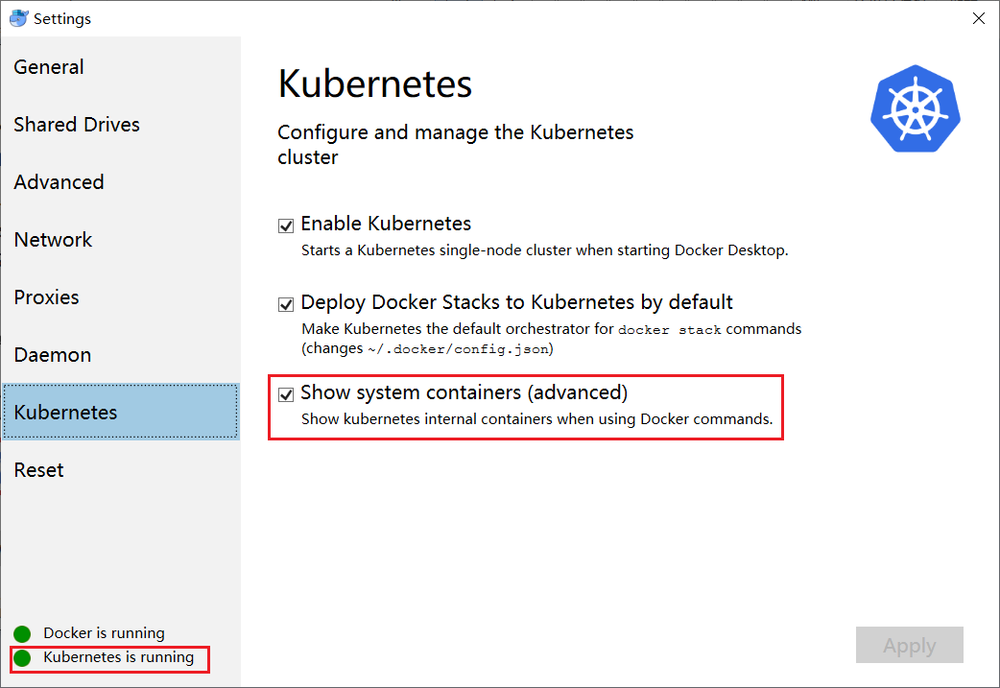
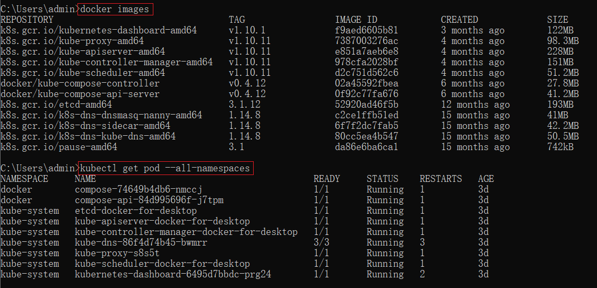
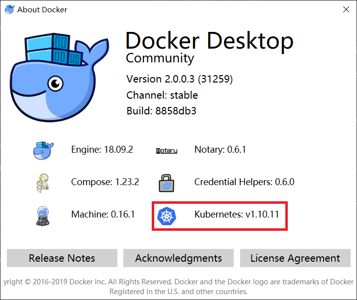

# 如何在Docker for windows上安装kubernetes？

Dockers这些年是越来越火，微软家的Windows也不干寂寞，在Windows 10 pro以及Windows 2016以上的版本添加了对docker的支持。这下子Windows环境的开发人员一下子方便多了，再也不需要额外的Linux服务器或者虚拟机了（好吧，本质还是虚拟机hyper-v）。更NICE的是从Docker for Windows 18.02 EDGE开始，增加了kubernetes的支持，并且kubectl也被加入到本地path里并设置好了context（如果里用kubectl操作其他contexts，记得切换）。这下更酷了，容器编排以及本地集群部署问题统统都给你解决了。

那么问题来了，我们如何安装docker for Windows呢？[官方的安装文档](https://docs.docker.com/docker-for-windows/install/)比较啰嗦，这里划下重点。

## 系统需求：
- Windows 10 64位：专业版，企业版，教育版（1607以后的版本）
- BIOS开启虚拟化（因为需要使用hyper-v跑docker的Linux镜像）
- CPU SLAT-capable功能
- 最少4GB内存（强烈建议本地开发机16GB以上内外，以及SSD硬盘，性能更优）

>PS：如果系统版本不够，无法使用hyper-v，可以考虑将系统升级到Windows 10 pro，譬如我的工作电脑原本是Windows 10 Home版，换个pro的key顺利升级为专业版。如果不具备升级条件，那么就考虑virtual box吧。

- docker for Windows包含：docker engine，docker CLI client，docker compose，docker machine，以及kitematic；
- Windows环境下的容器和镜像会能被所有用户访问；
- 在VMware下使用虚拟机内嵌技术也是可行的，但是官方不提供保证。

>PS: 官方提供的[Docker 兼容列表](https://success.docker.com/article/compatibility-matrix)

## 安装Docker Desktop for Windows

安装还是超级简单的，下载最新的[Docker Desktop Installer.exe](https://download.docker.com/win/stable/Docker%20for%20Windows%20Installer.exe)，然后照着安装向导完成安装吧。

## 启动Docker Desktop for Windows

点击`开始`，找到刚刚安装的`Docker Desktop`，屏幕右下角的状态栏里就会有docker的鲸鱼图标出现了。


为了方便，可以将开始菜单的`Docker Desktop`固定在开始屏幕上。刚安装完成，会有以下的弹出窗提示你登陆你的docker账号，没有就注册一个吧。


## 安装kubernetes

### 1.我能轻松翻墙：

安装kubernetes前，请务必先准备翻墙的梯子，最好是路由器级（也就是全局的，我用Windows本地的ss翻墙代理失败，后来使用家里路由器里的ss一次性成功，仅供参考）。

准备好梯子后，安装方法就很简单了，打开docker的settings界面，找到kubernetes的选项卡，分别勾选以下三项：
- Enable Kubernetes
- Deploy Docker Stacks to Kubernetes by default
- Show system containers(advanced)(勾选后方便查看当前的安装进度，安装成功后可以取消勾选)

然后点击Apply按钮开始安装，翻墙顺利的话，大约十来分钟（看网速）就可以看到安装成功的提示了。安装完成后kubernetes会自动进入运行状态，如下图所示：



安装的过程会比较慢，有时候网络不好的话，可能会好久都没反应，这时我们可以打开`cmd`通过docker和kubectl的命令查看基本的进度。

可以先用`docker images`查看当前已经拉下来的镜像，反复刷，直到下图中的相关镜像都下载下来。

中间可以穿插`kubectl get pod --all-namespaces`，查看当前k8s中运行的pod以及状态，如果发现状态出错的，就可能要回撤。

>PS: 安装过程中出错最简单的就是在docker desktop中直接恢复出厂设置，然后全部重来。



### 2.我不会翻墙：

如果没有全局翻墙条件，也可以手工将相关镜像拉到本地然后部署的方式。主要是使用docker在阿里云上的镜像，将相关文件拉到本地，请务必注意相关镜像的版本号。如果不清楚自己的docker desktop对应的版本号，可以打开about界面查看，如下图所示：



参考一键部署脚本（使用前可根据自己的实际情况修改版本号）：

```bat
#节点组件：每个node里的container都在一个私有网络中，kube-proxy的作用就是做一个反向代理，让访问者访问这个node的时候，可以转发到内部对应的container。
docker pull registry.cn-hangzhou.aliyuncs.com/google_containers/kube-proxy-amd64:v1.10.11
docker tag registry.cn-hangzhou.aliyuncs.com/google_containers/kube-proxy-amd64:v1.10.11 k8s.gcr.io/kube-proxy-amd64:v1.10.11
docker rmi registry.cn-hangzhou.aliyuncs.com/google_containers/kube-proxy-amd64:v1.10.11

#Master组件：k8s调度器，容器的启动、迁移、扩容缩减时候，选择哪个node，就看它了。
docker pull registry.cn-hangzhou.aliyuncs.com/google_containers/kube-scheduler-amd64:v1.10.11
docker tag registry.cn-hangzhou.aliyuncs.com/google_containers/kube-scheduler-amd64:v1.10.11 k8s.gcr.io/kube-scheduler-amd64:v1.10.11
docker rmi registry.cn-hangzhou.aliyuncs.com/google_containers/kube-scheduler-amd64:v1.10.11

#Master组件：k8s对node的控制行为，比如怎么去调用node启动一个容器。
docker pull registry.cn-hangzhou.aliyuncs.com/google_containers/kube-controller-manager-amd64:v1.10.11
docker tag registry.cn-hangzhou.aliyuncs.com/google_containers/kube-controller-manager-amd64:v1.10.11 k8s.gcr.io/kube-controller-manager-amd64:v1.10.11
docker rmi registry.cn-hangzhou.aliyuncs.com/google_containers/kube-controller-manager-amd64:v1.10.11

#Master组件：API服务器，对外暴露了Kubernetes的API，是Kubernetes的前端控制层。
docker pull registry.cn-hangzhou.aliyuncs.com/google_containers/kube-apiserver-amd64:v1.10.11
docker tag registry.cn-hangzhou.aliyuncs.com/google_containers/kube-apiserver-amd64:v1.10.11 k8s.gcr.io/kube-apiserver-amd64:v1.10.11
docker rmi registry.cn-hangzhou.aliyuncs.com/google_containers/kube-apiserver-amd64:v1.10.11

docker pull registry.cn-hangzhou.aliyuncs.com/google_containers/pause-amd64:3.1
docker tag registry.cn-hangzhou.aliyuncs.com/google_containers/pause-amd64:3.1 k8s.gcr.io/pause-amd64:3.1
docker rmi registry.cn-hangzhou.aliyuncs.com/google_containers/pause-amd64:3.1

#Master组件：etcd作为kubernetes的后端存储，存储了k8s自身的信息、以及各种业务容器信息等。
docker pull registry.cn-hangzhou.aliyuncs.com/google_containers/etcd-amd64:3.1.12
docker tag registry.cn-hangzhou.aliyuncs.com/google_containers/etcd-amd64:3.1.12 k8s.gcr.io/etcd-amd64:3.1.12
docker rmi registry.cn-hangzhou.aliyuncs.com/google_containers/etcd-amd64:3.1.12

#Master组件：DNS为Kubernetes服务提供DNS记录，是k8s的必需组件。
docker pull registry.cn-hangzhou.aliyuncs.com/google_containers/k8s-dns-sidecar-amd64:1.14.8
docker tag registry.cn-hangzhou.aliyuncs.com/google_containers/k8s-dns-sidecar-amd64:1.14.8 k8s.gcr.io/k8s-dns-sidecar-amd64:1.14.8
docker rmi registry.cn-hangzhou.aliyuncs.com/google_containers/k8s-dns-sidecar-amd64:1.14.8

docker pull registry.cn-hangzhou.aliyuncs.com/google_containers/k8s-dns-kube-dns-amd64:1.14.8
docker tag registry.cn-hangzhou.aliyuncs.com/google_containers/k8s-dns-kube-dns-amd64:1.14.8 k8s.gcr.io/k8s-dns-kube-dns-amd64:1.14.8
docker rmi registry.cn-hangzhou.aliyuncs.com/google_containers/k8s-dns-kube-dns-amd64:1.14.8

docker pull registry.cn-hangzhou.aliyuncs.com/google_containers/k8s-dns-dnsmasq-nanny-amd64:1.14.8
docker tag registry.cn-hangzhou.aliyuncs.com/google_containers/k8s-dns-dnsmasq-nanny-amd64:1.14.8 k8s.gcr.io/k8s-dns-dnsmasq-nanny-amd64:1.14.8
docker rmi registry.cn-hangzhou.aliyuncs.com/google_containers/k8s-dns-dnsmasq-nanny-amd64:1.14.8

#Master组件：dashboard提供了集群状态的只读概述。
docker pull registry.cn-hangzhou.aliyuncs.com/google_containers/kubernetes-dashboard-amd64:v1.10.1
docker tag registry.cn-hangzhou.aliyuncs.com/google_containers/kubernetes-dashboard-amd64:v1.10.1 k8s.gcr.io/kubernetes-dashboard-amd64:v1.10.1
docker rmi registry.cn-hangzhou.aliyuncs.com/google_containers/kubernetes-dashboard-amd64:v1.10.1

pause

```