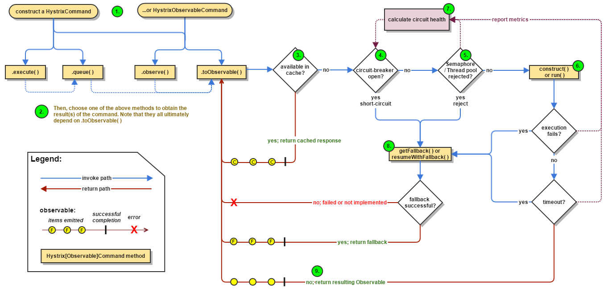

# 认识Hystrix


hystrix对应的中文名字是“豪猪”，豪猪周身长满了刺，能保护自己不受天敌的伤害，代表了一种防御机制，这与hystrix本身的功能不谋而合，因此Netflix团队将该框架命名为Hystrix，并使用了对应的卡通形象做作为logo。

在一个分布式系统里，许多依赖不可避免的会调用失败，比如超时、异常等，如何能够保证在一个依赖出问题的情况下，不会导致整体服务失败，这个就是Hystrix需要做的事情。Hystrix提供了熔断、隔离、Fallback、cache、监控等功能，能够在一个、或多个依赖同时出现问题时保证系统依然可用。

## Hello Hystrix

```java
public class CommandHelloWorld extends HystrixCommand<String> {
 
    private final String name;
 
    public CommandHelloWorld(String name) {
        super(HystrixCommandGroupKey.Factory.asKey("ExampleGroup")); //必须
        this.name = name;
    }
 
    @Override
    protected String run() {
        /*
         网络调用 或者其他一些业务逻辑，可能会超时或者抛异常
        */
        return "Hello " + name + "!";
    }
}
  
String s = new CommandHelloWorld("Bob").execute(); //
Future<String> s = new CommandHelloWorld("Bob").queue();
Observable<String> s = new CommandHelloWorld("Bob").observe();
Observable<String> s = new CommandHelloWorld("Bob").toObservable()
```

> 说明：

- execute() — blocks, then returns the single response received from the dependency (or throws an exception in case of an error)
- queue() — returns a Future with which you can obtain the single response from the dependency
- observe() — subscribes to the Observable that represents the response(s) from the dependency and returns an Observable that replicates that source Observable
- toObservable() — returns an Observable that, when you subscribe to it, will execute the Hystrix command and emit its responses

## Hystrix基本流程



> 说明：

1. Construct a HystrixCommand or HystrixObservableCommand Object
2. Execute the Command
3. Is the Response Cached?
4. Is the Circuit Open?
5. Is the Thread Pool/Queue/Semaphore Full?
6. HystrixObservableCommand.construct() or HystrixCommand.run()
7. Calculate Circuit Health
8. Get the Fallback
9. Return the Successful Response
