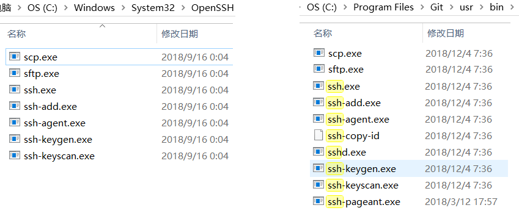

# 统一管理Windows环境下的OpenSSH

Windows 10从1709开始，默认在系统目录里带了OpenSSH客户端，这样对于开发人员就可以直接在cmd或者powershell上使用ssh命令。但是git-bash上也有一套相对独立的OpenSSH，两者的公钥私钥似乎不能统一管理，怎么办呢？

## 在git-bash上导入私钥
git-bash的命令窗口是通过MINGW64模拟的Linux环境，使用的大多是Linux命令。
```sh
#查看当前ssh命令的可用路径
$ where ssh
C:\Program Files\Git\usr\bin\ssh.exe
C:\Windows\System32\OpenSSH\ssh.exe

#查看当前ssh命令的实际路径
$ which ssh
/usr/bin/ssh
```
由此可见git-bash环境ssh命令默认使用的是MINGW64提供的版本，虚拟路径在`/usr/bin/ssh`目录，Windows下的真实路径是在`C:\Program Files\Git\usr\bin\ssh.exe`



打开目录对比我们会发现git-bash下的openssh组件更多更全，多了`ssh-pageant`, `sshd`, `ssh-copy-id`。

在git-bash环境下我们导入ssh秘钥，通常需要依次执行以下命令：
```sh
#生成一对RSA秘钥
$ ssh-keygen -t rsa -b 4096 -C "your_email@example.com"
Generating public/private rsa key pair.
Enter file in which to save the key (/C/Users/admin/.ssh/id_rsa): 
Enter passphrase (empty for no passphrase):
Enter same passphrase again:
Your identification has been saved in /C/Users/admin/.ssh/id_rsa.
Your public key has been saved in /C/Users/admin/.ssh/id_rsa.
The key fingerprint is:
SHA256:Nt6kfTgibJeHXcRlNt+jilOc9Xf9lFRPrYeT7K9sP9Y your_email@example.com
The key''s randomart image is:
+---[RSA 4096]----+
|              = +|
|           . + +=|
|            oo *+|
|          ..o X =|
|        S .+.o ==|
|     . o Xoo. ..+|
|      + BoB..  .o|
|     . o o.o ..oE|
|             .+oo|
+----[SHA256]-----+

#查看ssh-agent是否有运行
$ eval $(ssh-agent -s)
Agent pid 6048

#导入私钥
ssh-add -k ~/.ssh/id_rsa
```
> PS: 如果ssh-agent没有运行，ssh-add会报错，且执行ssh时也不会自动匹配秘钥

## 在cmd或powershell上导入私钥

git-bash会自动启动ssh-agent，但是Windows自带的openssh不会，ssh-agent是作为一个Windows服务而存在，因此需要在服务中将其启用（默认为禁用状态，可改为手动或者自动）。

powershell下查看ssh-agent服务并修改启动类型：
```powershell
#查看ssh-agent状态
> Get-Service ssh-agent

Status   Name               DisplayName
------   ----               -----------
Stopped  ssh-agent          OpenSSH Authentication Agent

#查看ssh-agent的启动模式，发现是禁用
> Get-Service ssh-agent | Select StartType

StartType
---------
Disabled

#修改ssh-agent的启动模式为手动
> Get-Service -Name ssh-agent | Set-Service -StartupType Manual

#启动ssh-agent服务
> Start-Service ssh-agent
```

除开ssh-agent的差异，ssh-keygen与ssh-add的用法与git-bash上都是一样的。关键问题在于，cmd和powershell下默认使用的是Windows自带的OpenSSH，而git-bash使用的是MINGW64自带的，两者是ssh-agent并不通用，导致的结果就是一对秘钥，我如果想在三个不同终端下使用，就得分别导入两次秘钥，偶尔一次还行，但是如果要管理的Linux系统比较多就很麻烦了。所以我们可以统一使用Windows自带的openssh，这样只需要将Windows下的ssh-agent服务设置为自动，则各个环境下都可以通用了。

## 在git-bash上修改默认的ssh路径

前文我们已经发现git-bash的路径里也是有Windows下安装的OpenSSH的，但是不是默认的，这是由于git-bash的环境变量PATH里，Linux的相关路径排在Windows的PATH变量前面，所以会优先命中`/usr/bin/ssh`。我们可以查看下git-bash下的PATH值：
```sh
$ env | grep ^PATH= | sed 's/\:/\n/g'
PATH=/c/Users/admin/bin
/mingw64/bin
/usr/local/bin
/usr/bin
/bin
/mingw64/bin
/usr/bin
/c/Users/admin/bin
/c/Program Files (x86)/NetSarang/Xftp 6
/c/Program Files (x86)/NetSarang/Xshell 6
/c/ProgramData/DockerDesktop/version-bin
/c/Program Files/Docker/Docker/Resources/bin
/c/Program Files (x86)/Common Files/Oracle/Java/javapath
/c/Windows/system32
/c/Windows
/c/Windows/System32/Wbem
/c/Windows/System32/WindowsPowerShell/v1.0
/c/Windows/System32/OpenSSH
/c/Program Files/Intel/WiFi/bin
/c/Program Files/Common Files/Intel/WirelessCommon
/c/MyApps/mysql-8.0.15-winx64/bin
/c/Program Files/Java/jdk1.8.0_201/bin
/cmd
/c/Users/admin/AppData/Local/Microsoft/WindowsApps
/c/Users/admin/AppData/Local/Programs/Microsoft VS Code/bin
/usr/bin/vendor_perl
/usr/bin/core_perl
```

我们可以看到Linux的几个目录的优先级明显高于Windows的默认PATH，但是其中有一个置顶的居然是`/c/Users/admin/bin`，而这个路径Windows实际上压根儿没有用到。那岂不是说做一个该路径到`/c/Windows/System32/OpenSSH`的软链接就可以了？想到就做，git-bash下的`ln -s`默认是创建不了软链接的，而是会将目标文件/目录直接copy过来，虽然也可以实现我们的预期，但是本地又多了一份OpenSSH也是相当令人不爽的。要实现软链接，方法如下：
```sh
#用管理员打开git-bash，修改MSYS值
$ export MSYS=winsymlinks:nativestrict

#创建OpenSSH到bin的软链接
$ ln -s "/c/Windows/System32/OpenSSH" ~/bin

#查看软链接创建结果，看到bin目录有正常链接过去就OK
$ ls -l
total 9073
lrwxrwxrwx 1 admin 197121      59 3月   4 12:07  「开始」菜单 -> '/c/Users/admin/AppData/Roaming/Microsoft/Windows/Start Menu'/
drwxr-xr-x 1 admin 197121       0 3月  20 21:09 '3D Objects'/
drwxr-xr-x 1 admin 197121       0 3月   4 12:07  AppData/
lrwxrwxrwx 1 admin 197121      30 3月   4 12:07 'Application Data' -> /c/Users/admin/AppData/Roaming/
lrwxrwxrwx 1 admin 197121      27 5月  14 16:44  bin -> /c/Windows/System32/OpenSSH/
drwxr-xr-x 1 admin 197121       0 3月  20 21:09  Contacts/
...
```

至此，cmd、powershell以及git-bash三个终端使用的ssh都是同一份应用了，秘钥也终于可以统一管理了，真是可喜可贺:)