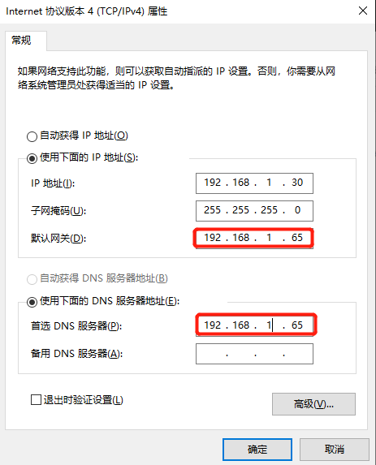

# 单网卡玩转智能网关——把OpenWRT塞进虚拟机

玩过智能路由器的同学可能都知道，国内比较火的koolshare论坛提供的梅林固件的那个强大：科学上网、游戏加速、自动签到、VPN服务器、FTP服务器、智能去广告、动态DNS、内网穿透、BT下载、私有云、KMS等众多扩展软件，让你的路由器从此变的强大无比。但是呢，梅林固件支持的路由器毕竟有限，我们不一定刚好拥有，另外如果我们想在工作场所一样拥有强大且不受限的网络访问能力怎么办呢？这里我们就可以考虑软路由了。

软路由是指利用台式机或服务器配合软件形成路由解决方案，主要靠软件的设置，达成路由器的功能；而硬路由则是以特有的硬设备，包括处理器、电源供应、嵌入式软件，提供设定的路由器功能。常见的有海蜘蛛、OpenWRT、DDWRT、Tomato等，这些系统共有的特点是一般对硬件要求较低，甚至只需要一台486电脑，一张软盘，两块网卡就可以安装出一台非常专业的软件防火墙。

## 系统需求：
- Windows 7/8/10 64位：专业版，企业版，教育版
- BIOS开启虚拟化（因为需要使用hyper-v或者vmware跑OpenWRT）
- 最少4GB内存（要开虚拟机，低于4GB也能玩，但不建议长时间使用）
- Hyper-V或者Vmware Player等虚拟机软件

>PS：如果系统版本不够，无法使用hyper-v，可以考虑将系统升级到Windows 10 pro，譬如我的工作电脑原本是Windows 10 Home版，换个pro的key顺利升级为专业版。如果不具备升级条件，那么就考虑vmware player吧，效果是完全一样的。

## 下载OpenWRT镜像与转盘工具

第一步是系统开启hyper-v（本文全文以hyper-v为例，vmware操作基本类似），这个网上教程还是很多的，这里我就不赘述了。首先去[koolshare](http://firmware.koolshare.cn/LEDE_X64_fw867/)下载[OpenWRT](http://firmware.koolshare.cn/LEDE_X64_fw867/%E8%99%9A%E6%8B%9F%E6%9C%BA%E8%BD%AC%E7%9B%98%E6%88%96PE%E4%B8%8B%E5%86%99%E7%9B%98%E4%B8%93%E7%94%A8/openwrt-koolshare-mod-v2.30-r10402-51ad900e2c-x86-64-uefi-gpt-squashfs.img.gz)的镜像文件。

>需要注意的是，koolshare官网的[下载目录](http://firmware.koolshare.cn/LEDE_X64_fw867/)里，有一个目录是`虚拟机转盘或PE下写盘专用`，点击进来有两个镜像文件，一个是非UEFI的兼容镜像，支持hyper-v一代机；另一个uefi-gpt镜像可以使用hyper-v的二代机。本文以第二个uefi-gpt的镜像为例展开。

文件不大，40MB+多点儿，下载下来后由于是img.gz结尾，我们需要先用7-zip等压缩软件解压得到img文件，由于hyper-v的硬盘文件为vhdx，所以我们还需要虚拟机磁盘文件转换的工具[StarWind V2V Converter](https://www.starwindsoftware.com/starwind-v2v-converter)，该工具官网可以免费下载使用。

## 转写hyper-v硬盘文件

将下载下来的`openwrt-koolshare-mod-v2.30-r10402-51ad900e2c-x86-64-uefi-gpt-squashfs.img.gz`文件，用7-zip解压，的到`openwrt-koolshare-mod-v2.30-r10402-51ad900e2c-x86-64-uefi-gpt-squashfs.img`。然后启动StarWind V2V Converter，按如下步骤操作完成镜像转换：

- 双击打开StarWind V2V Converter
- 在Select location of image to convert界面，选择Local file
- 在Source image界面，选择你解压出来的`openwrt-koolshare-mod-v2.30-r10402-51ad900e2c-x86-64-uefi-gpt-squashfs.img`文件
- 在Select location of destination image界面，选择Local file
- 在Select destination image format界面，选择VHD/VHDX
- 在Select option for VHD/VHDX image format界面，选择VHDX growable image
- 在Set destination file name界面，选择文件保存地址，这里默认即可
- 完成转换，得到`openwrt-koolshare-mod-v2.30-r10402-51ad900e2c-x86-64-uefi-gpt-squashfs.vhdx`文件

## 配置网络和虚拟机

首先确保你已经安装了Hyper-V组件。在开始按钮右边的搜索栏里输入`hyper-v`，在弹出的搜索结果里点击`Hyper-V管理器`。

### 1.创建虚拟交换机
在弹出的`Hyper-V管理器`的右边，点击`虚拟交换机管理器`，按如下步骤依次创建桥接模式的虚拟交换机：
- 左侧选择`新建虚拟交换机`，右侧选择`外部`，点击`创建虚拟交换机`
- 在新出现的虚拟交换机的右侧名称处，填写`Bridge Switch`，连接类型保持`外部网络`，网卡下拉列表里务必选择物理机的真实物理网卡。这里是以单网卡为例讲解，一般默认的网卡即你的外部网络访问网卡，如WiFi网卡。如果你有多个物理网卡，请选择你需要桥接的网卡。
- 保持勾选`允许管理操作系统共享此网络适配器`
- 点击确认完成交换机的创建

### 2.创建虚拟机
在`Hyper-V管理器`的右边，点击`新建`->`虚拟机`，按如下步骤依次创建虚拟机：
- 指定名称和位置：名称填Openwrt
- 指定代数：这里我们选择第二代，因为前面我们下载的是支持uefi的镜像，所以可以选择第二代，否则请使用第一代
- 分配内存：这里填512MB足够了，如果你的内存够多，分个1024也没关系
- 配置网络：这里选择刚刚创建的`Bridge Switch`
- 连接虚拟硬盘：这里选择使用现有的虚拟硬盘，文件即前面我们转换出来的`openwrt-koolshare-mod-v2.30-r10402-51ad900e2c-x86-64-uefi-gpt-squashfs.vhdx`文件
- 摘要：最后确认下没问题就点完成，开始创建虚拟机

### 3.配置虚拟机
在`Hyper-V管理器`的中间，我们可以看到刚刚创建的名为`Openwrt`的虚拟机，右键选择设置：
- 在设置窗口的左侧，找到安全选项卡：去掉右侧的`启用安全启动`勾选
- 内存：512MB足够，如果你的内存不多的话，还可以启动动态内存，并将最小RAM设置为256MB
- 处理器：1个虚拟处理器足够
- 自动启动操作：如果想Windows启动就让软路由提供服务，可以选择
- 自动停止操作：选择强行关闭虚拟机

完成以上配置后，即可启动虚拟机，并连接上去看控制台的输出。待控制台输出稳定后，回车输入`ifconfig`可以查看到当前的网卡配置。其中，br-lan网卡的IP地址即我们桥接上去的网卡地址，如果默认的IP地址的地址段与物理网卡的地址段不一致，我们可以输入`vim /etc/config/networt`打开网络配置的编辑窗口，找到第三块的`config interface 'lan'`设置并修改响应的IP地址与网关地址。参考配置如下：

```ini
config interface 'lan'
        option type 'bridge'
        option ifname 'eth0'
        option proto 'static'
        option ipaddr '192.168.1.10'    #修改为可用的固定IP地址
        option netmask '255.255.255.0'    #子网掩码与你的物理网卡保持一致
        option ip6assign '60'
        option multipath 'off'
        option gateway '192.168.1.1'    #网关地址与你的物理网卡保持一致
        option dns '192.168.1.1 223.6.6.6'    #DNS地址与你的物理网卡保持一致

```

如果你是通过DHCP动态获取IP地址，无法确定可用的固定IP地址，也可以使用DHCP动态获取openwrt的IP地址。参考配置如下：
```ini
config interface 'lan'
        option type 'bridge'
        option ifname 'eth0'
        option proto 'dhcp'
        option multipath 'off'
        option delegate '0'
        option peerdns '0'
        option dns '192.168.1.1 223.6.6.6'   #DNS地址与你的物理网卡保持一致
        option clientid 'a1'    #clientID在某些DHCP服务器上需要，防止通过WiFi网卡桥接时，获取到的IP地址与物理网卡重复，可选

```

完成以上修改后，保存并重启虚拟机。虚拟机重启后，在cmd里通过`ping openwrt`能顺利ping通则表示网卡配置正确了。在浏览器里输入[http://openwrt](http://openwrt)打开软路由的配置页，在`网络`->`接口`中，即可看到刚才我们配置的网卡，在这里也可以通过图形界面修改了。

## 安装网络工具并测试效果

软路由到此算是可以使用了，那么我们装个科学上网看看效果呗。点击软路由配置页左侧的`酷软`，在右侧软件中心选择`未安装`选项卡，在软件列表中找到`科学上网`，点击安装。安装完成后，按照你的shadowsocks服务器配置信息配置一个节点并点击应用。提交完成后，上方会有绿色的国内、国外线路状态，如果都连通则表示你的shadowsocks配置没有问题，可以正常使用，否则请检查配置。


软路由上翻墙工具安装配置完毕后，我们配置下本地网卡试试效果吧。最快捷的方式，当然是修改局域网上某一台电脑的网卡，将网卡的网关地址修改为openwrt的地址。这里我们主要目的是给本机提供全局翻墙服务，那么我们就修改本地桥接网卡的地址吧。
- 打开`网络和共享中心`，点击左侧的`更改适配器设置`
- 鼠标右键选择`vEthernet(Bridge Switch)`，点`属性`
- 找到`Internet 协议版本4（TCP/IPv4）`，双击打开IP设置
- 选择手工输入IP地址和DNS，其中IP地址和子网掩码保持不变，网关和DNS改为`openwrt`的IP地址

>PS：如果你是通过DHCP获取的动态IP地址，可以通过上文提到的`ping openwrt`取的openwrt的IP地址



本地网卡配置完毕后，打开浏览器，分别打开百度和谷歌，搜索IP看看返回的IP地址，如果顺利就会看到访问谷歌的时候返回的IP地址已经是你的shadowsocks服务器的地址了。

到此一个单网卡下，可以全局科学上网的软路由算是配置完成了。你可以在openwrt中安装其他你需要的软件了，譬如动态域名解析、内网穿透、策略路由、KMS、去广告等你需要的工具。