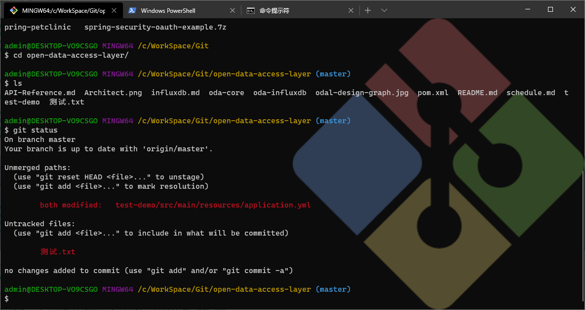

# Windows 10 Terminal初体验

## Terminal介绍

> Windows Terminal is a new, modern, feature-rich, productive terminal application for command-line users. It includes many of the features most frequently requested by the Windows command-line community including support for tabs, rich text, globalization, configurability, theming & styling, and more.

> The Terminal will also need to meet our goals and measures to ensure it remains fast and efficient, and doesn't consume vast amounts of memory or power.

简单点说呢，就是说Terminal是新时代的命令行工具，更新更全更漂亮，基本上我们日常用到的各种命令行工具都集成进去了。

## 怎么安装

> 安装Windows Terminal需要将Windows 10升级到1903 (build 18362)以上版本，我直接升级到了最新发布的2004版。

### 1. 通过Windows应用商店安装[推荐]

开始菜单里找Windows应用商店，或者直接输入store就可以在列表里看到。打开商店后输入`Windows Terminal`，看到免费的那个就是了，点击免费`获取`就会出现在下载列表里，不知道是否是网络问题，大概要过好几分钟才会安装好。

### 2. 通过Github下载安装

相比与商店直接安装，通过github可以拿到最新的安装包，甚至是最新源码直接本地编译出独属于自己的那一份。下载可以通过github的[release page](https://github.com/microsoft/terminal/releases)找到各版本的下载包与源码。

> 如果是手动下载安装，需要注意的是：
> - 首先要安装依赖[Desktop Bridge VC++ v14 Redistributable Package](https://www.microsoft.com/en-us/download/details.aspx?id=53175) 
> - 手工安装的版本不会自动更新，如果需要新版本，需要再次到github上下载新版本。

另外还可以通过Windows Package Manager CLI以及Chocolatey来安装，不太常用就没尝试了。

## 自定义与美化

刚安装的Windows Terminal，默认有3个功能项，分别是`powershell`、`命令行（cmd）`、`Azure Cloud Shell`。既然要一统所有的命令行工具，没有熟悉的Git与ssh怎么能行？


### 1. 配置Git Bash

配置git前，我们需要先安装git for Windows，这里就不介绍了，网上大把教程。安装完毕我们一般会有git bash，通过这货我们可以用我们熟悉的Linux命令操作命令行。那怎么把git bash集成到Terminal呢？

点击顶部tab页最右边的向下的菜单，选`设置`，即可选择我们熟悉的编辑器打开用户配置文件`settings.json`。在json文件中找到profiles.list下的3个配置，分别是前文提到的`powershell`、`命令行（cmd）`、`Azure Cloud Shell`，我们在我们喜欢的位置插入Git Bash的配置（譬如cmd的后面），如下：

```json
    {
        // Make changes here to the git-bash.exe profile.
        "guid": "{5f560dad-38b7-51cf-b940-2309a097f589}",
        "name": "Git Bash",
        "commandline": "C:\\Program Files\\Git\\bin\\bash.exe  --cd-to-home",
        "icon": "C:\\Users\\admin\\Pictures\\icons\\git-icon.png",
        "backgroundImage": "C:\\Users\\admin\\Pictures\\icons\\git-icon.png",
        "backgroundImageStretchMode": "uniform",
        "backgroundImageAlignment": "right",
        "backgroundImageOpacity": 0.3,
        "hidden": false
    },
```

其中[guid随机生成](http://www.uuid.online/)一个，不要跟其他的重复即可。这里文件的路径大家要根据自己的实际情况配置，我安装的是默认路径。另外就是icon图标，给大家准备好了高清大图，点[这里下载](../images/git-icon.png)。至于效果嘛，大家看下面的截图：



> 大家有注意到没，无论是ls命令，还是git status命令，中文文件名都能正确显示了。怎么做到的呢？
> - ls乱码问题：找到git安装目录，打开etc文件夹，找到bash.bashrc，用管理员权限打开后，添加一行`export LC_ALL=en_US.UTF-8`
> - git status乱码问题：git bash下输入`git config --global core.quotepath false`

### 2. 配置ssh

ssh依赖OpenSSH，好在Windows 10 1903以上版本都默认集成了OpenSSH，所以直接用即可。至于ssh命令怎么用，怎么配证书，这里不做介绍，请自行Google。直接附上我的ssh配置如下：

```json
    {
        "guid": "{3451d145-91a7-4baa-928d-7d254f85fb4b}",
        "hidden": false,
        "name": "Docker-Host(CentOS V7.8)",
        "commandline": "ssh java@10.0.0.120",
        "colorScheme": "Vintage",
        "icon" : "ms-appx:///ProfileIcons/{9acb9455-ca41-5af7-950f-6bca1bc9722f}.png",
        "backgroundImage": "C:\\Users\\admin\\Pictures\\icons\\red-leaf.png",
        "backgroundImageStretchMode": "uniform",
        "backgroundImageAlignment": "right",
        "backgroundImageOpacity": 0.5,
        "hidden": false
    },
    {
        "guid": "{28b7d145-41aa-90a7-928d-7d154f85fb4b}",
        "hidden": false,
        "name": "Docker over Socks5(Azure)",
        "commandline": "ssh -i C:/Users/admin/.ssh/azure_rsa_2048 -o \"ProxyCommand C:/Program Files/Git/mingw64/bin/connect.exe -S 10.0.0.253:1080 %h %p\" docker@target-host-domain.com",
        "colorScheme": "Vintage",
        "icon" : "C:\\Users\\admin\\Pictures\\icons\\v2.png",
        "backgroundImage": "C:\\Users\\admin\\Pictures\\icons\\lotus.png",
        "backgroundImageStretchMode": "uniform",
        "backgroundImageAlignment": "right",
        "backgroundImageOpacity": 0.3,
        "hidden": false
    },
```

这里有两个ssh的配置，一个是本地局域网的Linux主机，通过ssh命令选择默认的证书登陆，是最简单的配置。另一个则是公有云上的主机，有防火墙隔离，访问需要通过公司内部的socks5代理，这个就略麻烦些。在配置里的`-i C:/Users/admin/.ssh/azure_rsa_2048`用来指定特定的身份验证私钥，而`-o \"ProxyCommand C:/Program Files/Git/mingw64/bin/connect.exe -S 10.0.0.253:1080 %h %p\"`则是用来指定socks5代理。其中用到了git安装包里的connect.exe，该应用支持http与socks代理。


### 更多设置

Terminal更多更详细的设置，可以参考微软的[官方文档](https://docs.microsoft.com/zh-cn/windows/terminal/customize-settings/profile-settings)。

另外还有一些非常有意思的玩意儿，譬如专为程序员撸代码设计的字体：[Cascadia Code](https://docs.microsoft.com/zh-cn/windows/terminal/cascadia-code)，大家有兴趣也可以自行体验。
